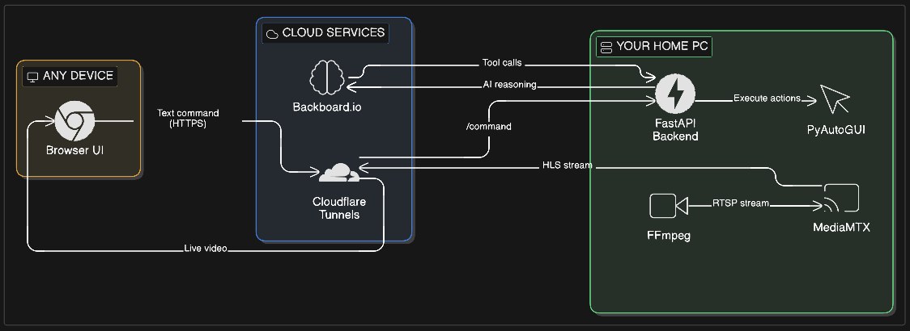

# Remoto AI - Voice-Controlled Remote Computer Access

## Project Overview

Remoto AI enables secure remote access and control of your computer through voice commands from anywhere in the world. Powered by **Backboard.io**, the system combines speech recognition, persistent AI memory, and real-time streaming to provide an intelligent assistant that learns your workflows and remembers your preferences.

**Built for the McHacks 13 x Backboard.io Challenge**



## System Architecture

### Frontend Interface

Built with React and react-speech-recognition for speech-to-text conversion. The interface handles user authentication through Supabase and provides real-time video streaming from the remote computer.

### Backend Services

A Python service runs persistently on the local computer, managing authentication, command execution, and media streaming.

### AI Agent Core (Powered by Backboard.io)

The AI agent leverages Backboard.io's modular features:

-   **LLM Routing**: Unified API for Claude, GPT, and 2200+ models
-   **Stateful Memory**: Persistent conversation threads across sessions
-   **Memory Orchestration**: Learns custom workflows and user preferences
-   **RAG (BM25)**: Instant lookup of 200+ keyboard shortcuts
-   **Web Search**: Dynamically learns shortcuts for new applications
-   **Custom Tools**: Structured actions for reliable computer control
-   **Model Configurability**: Switch between models without losing context

The agent:
-   Receives transcribed text from speech input
-   Captures screen content using OpenCV for image processing
-   Extracts textual context using Tesseract OCR
-   Uses Backboard custom tools to execute reliable actions
-   Remembers your workflows and preferences permanently
-   Provides audio confirmation through Google Text-to-Speech

### Media Streaming Pipeline

Live screen content is streamed using MediaMTX and FFmpeg for encoding, with global delivery handled through Cloudflare. This ensures low-latency visual feedback to users during remote sessions.

## Workflow Process

1. **Authentication & Connection**
   Users securely login through Supabase authentication, establishing a connection to their home computer running the Python backend service.

2. **Voice Command Processing**
   Speech input is captured via the React interface and converted to text using speech recognition libraries.

3. **Screen Analysis & Command Generation**
   The AI agent captures the current screen state, resizes images using OpenCV, and extracts UI context with Tesseract OCR. This contextual information combined with the user's command enables the agent to generate precise keyboard and mouse actions.

4. **Action Execution**
   Generated commands are executed on the remote computer using pyautogui, performing the requested operations with screen-relative precision.

5. **User Feedback**
   Upon task completion, the system provides audio confirmation via Google Text-to-Speech, informing users of successful command execution while the live stream displays the updated screen state.

## Technical Implementation

The system integrates multiple technologies including React for the user interface, Python for backend services, OpenCV and Tesseract for computer vision tasks, pyautogui for system control, and MediaMTX with Cloudflare for streaming delivery. Speech processing handles both input transcription and output audio responses, creating a seamless voice-controlled remote access experience.

## Quick Start

### Prerequisites

1. **Get Backboard.io API Key**:
   - Register at: https://app.backboard.io/hackathons
   - Use promo code: `MCHACKS26`
   - Copy your API key

### Installation

```bash
# Clone the repository
git clone https://github.com/yourusername/remoto.git
cd remoto

# Install the package
pip install -e .

# Create .env file
echo "BACKBOARD_API_KEY=your_api_key_here" > .env
```

### First Run

```bash
# Check and install dependencies
remoto setup

# Start all services
remoto start
```

## CLI Commands

```bash
remoto start          # Start all services
remoto stop           # Stop all services
remoto restart        # Restart all services
remoto status         # Show status of all services (includes URLs)
remoto setup          # Check and install dependencies
remoto password       # Show current session password
remoto password show  # Show current session password (explicit)
remoto password set   # Set a new session password
```

### Password Management

Manage your session password with the `password` command:

```bash
# Show current password
remoto password
# or
remoto password show

# Generate a random password
remoto password set --generate
# or
remoto password set -g

# Set a specific password
remoto password set --new-password "MySecurePass123"
# or
remoto password set -p "MySecurePass123"

# Interactive prompt (press Enter to generate random)
remoto password set
```

**Note:** If the backend is running when you change the password, it will automatically restart with the new password.

### Command Options

```bash
remoto start --no-frontend   # Start backend only (no web UI)
remoto start --skip-check    # Skip dependency check (use if dependencies are installed)
```

## Backboard.io Integration

Remoto AI uses all 8 modular features from Backboard.io:

### Core Features
1. **LLM Routing** - Switch between Claude/GPT seamlessly
2. **Stateful API** - Thread-based conversations
3. **Memory** - Conversation persists across page refreshes
4. **RAG** - 200+ keyboard shortcuts database
5. **Web Search** - Learns new app shortcuts dynamically
6. **Custom Tools** - 5 specialized tools for computer control
7. **Configurability** - Model switching without losing context
8. **Memory Orchestration** - Remembers custom workflows

### Custom Tools
- `launch_app` - Open Windows applications
- `navigate_url` - Browser navigation
- `find_and_click` - OCR-based UI interaction
- `execute_workflow` - Multi-step automation
- `get_shortcut` - Smart shortcut lookup (RAG → Web Search fallback)

### Example: Teaching Workflows
```
You: "Remember: work mode means open VSCode and Chrome"
AI: "Got it, I'll remember your work mode workflow"

*Later, even after restart:*

You: "Start work mode"
AI: *Opens both applications automatically*
```

## Security Notes

-   **Session Passwords**: Auto-generated and stored locally in `~/.remoto/data/session_password.txt`
-   **Password Management**: Use `remoto password set` to change your password
-   **Password Requirements**: Passwords must be at least 8 characters long
-   **Secure Communication**: All communication through Cloudflare tunnels (HTTPS)
-   **HTTP Basic Auth**: API endpoints protected with authentication
-   **Environment Variables**: Never commit `.env` files to version control
-   **API Keys**: Store your `BACKBOARD_API_KEY` in `.env` (not committed to git)

## Troubleshooting

### Services won't start

```bash
# Check dependencies
remoto setup

# Check service status
remoto status

# View logs (stored in ~/.remoto/logs/)
```

### Password issues

```bash
# View current password
remoto password

# Change password
remoto password set --generate

# If backend needs restart after password change
remoto restart
```

### FFmpeg encoding issues

-   Ensure your GPU drivers are up to date
-   Check that hardware encoding is supported: `ffmpeg -encoders | grep nvenc`
-   The CLI will automatically fall back to CPU encoding if needed

### Cloudflare tunnel issues

-   Ensure Cloudflared is installed and in PATH
-   Check firewall settings
-   Try restarting: `remoto restart`
