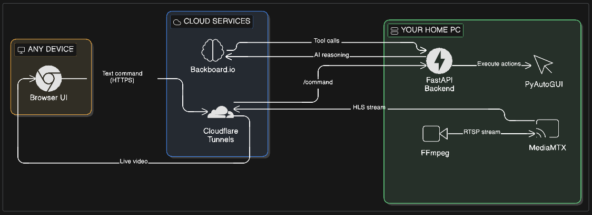
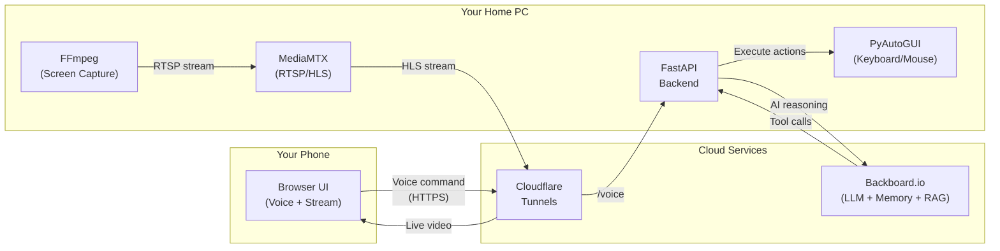

# Remoto AI

**Voice-controlled remote computer access from anywhere in the world.**

[](https://www.python.org/downloads/)
[](LICENSE)
[](https://mchacks.ca/)
[](https://backboard.io/)

Remoto AI lets you control your home PC from any device using voice commands. It combines speech recognition, AI-powered screen understanding, and real-time streaming to create an intelligent assistant that learns your workflows and remembers your preferences -- powered by [Backboard.io](https://backboard.io/).



---

## Table of Contents

- [Features](#features)
- [Architecture](#architecture)
- [Tech Stack](#tech-stack)
- [Quick Start](#quick-start)
- [CLI Reference](#cli-reference)
- [API Endpoints](#api-endpoints)
- [Backboard.io Integration](#backboardio-integration)
- [Project Structure](#project-structure)
- [Security](#security)
- [Troubleshooting](#troubleshooting)
- [Contributing](#contributing)
- [License](#license)

---

## Features

- **Voice Control** -- Speak commands on your phone, and Remoto executes them on your PC
- **AI Screen Understanding** -- Captures and analyzes screen content with OCR (Tesseract) and vision models
- **Smart Model Routing** -- Automatically selects the best LLM (Gemini Flash, GPT-4.1, Claude Sonnet) based on task complexity
- **Persistent Memory** -- Remembers your workflows, shortcuts, and preferences across sessions
- **12 Custom Tools** -- Launch apps, navigate URLs, click elements, type text, press hotkeys, scroll, create workflows, and more
- **Real-Time Streaming** -- Low-latency screen stream via MediaMTX + FFmpeg + Cloudflare tunnels
- **Cross-Platform CLI** -- One-command setup and management for Windows, macOS, and Linux
- **Keyboard Shortcut RAG** -- Instant lookup of 200+ keyboard shortcuts with web search fallback

---

## Architecture


```mermaid
flowchart LR
    subgraph phone [Your Phone]
        Browser["Browser UI\n(Voice + Stream)"]
    end

    subgraph cloud [Cloud Services]
        CFTunnel["Cloudflare\nTunnels"]
        Backboard["Backboard.io\n(LLM + Memory + RAG)"]
    end

    subgraph pc [Your Home PC]
        Backend["FastAPI\nBackend"]
        MediaMTX["MediaMTX\n(RTSP/HLS)"]
        FFmpeg["FFmpeg\n(Screen Capture)"]
        PyAutoGUI["PyAutoGUI\n(Keyboard/Mouse)"]
    end

    Browser -->|"Voice command\n(HTTPS)"| CFTunnel
    CFTunnel -->|"/voice"| Backend
    Backend -->|"AI reasoning"| Backboard
    Backboard -->|"Tool calls"| Backend
    Backend -->|"Execute actions"| PyAutoGUI
    FFmpeg -->|"RTSP stream"| MediaMTX
    MediaMTX -->|"HLS stream"| CFTunnel
    CFTunnel -->|"Live video"| Browser
```

### How It Works

1. **Authentication** -- You open the Cloudflare tunnel URL on your phone and enter your session password.
2. **Voice Input** -- Speech is captured via [annyang.js](https://github.com/TalAter/annyang) and sent as text to the backend.
3. **Screen Analysis** -- The backend captures a screenshot, resizes it to 1280x720, and runs Tesseract OCR to extract on-screen text with coordinates.
4. **AI Reasoning** -- The transcribed command + OCR context + screenshot are sent to Backboard.io, which routes to the optimal LLM and returns tool calls.
5. **Action Execution** -- Tool calls are executed via PyAutoGUI (clicking, typing, launching apps, etc.) on the home PC.
6. **Feedback** -- A spoken confirmation is generated with Google TTS and played back; the live stream shows the updated screen.

---

## Tech Stack

| Layer | Technologies |
|-------|-------------|
| **Frontend** | Vanilla HTML/CSS/JS, [annyang.js](https://github.com/TalAter/annyang) (speech recognition) |
| **Backend** | Python, [FastAPI](https://fastapi.tiangolo.com/), [Uvicorn](https://www.uvicorn.org/) |
| **AI / LLM** | [Backboard.io](https://backboard.io/) (LLM routing, memory, RAG, tools) |
| **Computer Vision** | [OpenCV](https://opencv.org/), [Tesseract OCR](https://github.com/tesseract-ocr/tesseract), [Pillow](https://pillow.readthedocs.io/) |
| **Automation** | [PyAutoGUI](https://pyautogui.readthedocs.io/) |
| **Streaming** | [FFmpeg](https://ffmpeg.org/), [MediaMTX](https://github.com/bluenviron/mediamtx) |
| **Tunneling** | [Cloudflare Tunnels](https://developers.cloudflare.com/cloudflare-one/connections/connect-networks/) |
| **TTS** | [gTTS](https://gtts.readthedocs.io/) (Google Text-to-Speech) |
| **CLI** | [Click](https://click.palletsprojects.com/) |

---

## Quick Start

### Prerequisites

- **Python 3.8+**
- **Backboard.io API Key** -- Register at [app.backboard.io/hackathons](https://app.backboard.io/hackathons) (promo code: `MCHACKS26`)

### Installation

```bash
# Clone the repository
git clone https://github.com/muhammadbalawal/remoto.git
cd remoto

# Install the package (editable mode)
pip install -e .

# Create your environment file
cp server/.env.example server/.env
# Edit server/.env and add your BACKBOARD_API_KEY
```

### First Run

```bash
# Check and install external dependencies (FFmpeg, MediaMTX, Cloudflared, Tesseract)
remoto setup

# Start all services
remoto start
```

Once started, Remoto will display:
- **API URL** -- Open this on your phone to access the voice interface
- **Session Password** -- Enter this when prompted for authentication

---

## CLI Reference

The `remoto` CLI manages all services with a single command.

| Command | Description |
|---------|-------------|
| `remoto start` | Start all services (MediaMTX, FFmpeg, tunnels, backend) |
| `remoto stop` | Stop all services |
| `remoto restart` | Restart all services |
| `remoto status` | Show status and URLs for all services |
| `remoto setup` | Check and auto-install external dependencies |
| `remoto password` | Show the current session password |
| `remoto password show` | Show the current session password (explicit) |
| `remoto password set` | Set a new password (interactive prompt) |
| `remoto password set -g` | Generate a random password |
| `remoto password set -p "pass"` | Set a specific password |

### Start Options

| Flag | Description |
|------|-------------|
| `--no-frontend` | Start backend only (skip web UI serving) |
| `--skip-check` | Skip dependency verification on startup |

---

## API Endpoints

The FastAPI backend exposes three endpoints:

| Method | Path | Auth | Description |
|--------|------|------|-------------|
| `GET` | `/` | Basic | Serves the web UI (`index.html`) |
| `GET` | `/health` | None | Health check -- returns `{"status": "healthy"}` |
| `GET` | `/config` | Basic | Returns stream URL and session config |
| `POST` | `/voice` | None | Main voice command endpoint |

### `POST /voice`

Accepts a voice command, captures a screenshot, runs OCR, queries the AI, executes tool calls, and returns a response with audio.

**Request body:**
```json
{
  "text": "open chrome and go to github",
  "thread_id": "optional-thread-id",
  "history": []
}
```

**Response:**
```json
{
  "assistant_message": "Opened Chrome and navigated to GitHub.",
  "assistant_audio_base64": "base64-encoded-mp3...",
  "screenshot_base64": "base64-encoded-png...",
  "thread_id": "thread-id",
  "success": true,
  "analysis": {
    "model": "openai/gpt-4.1",
    "complexity": "medium",
    "tool_calls": [...]
  }
}
```

---

## Backboard.io Integration

Remoto AI uses all 8 modular features from Backboard.io:

| Feature | Usage |
|---------|-------|
| **LLM Routing** | Unified API for Claude, GPT, and Gemini -- model selected by task complexity |
| **Stateful API** | Thread-based conversations that persist context |
| **Memory** | Conversations persist across page refreshes and restarts |
| **RAG (BM25)** | 200+ keyboard shortcuts indexed for instant retrieval |
| **Web Search** | Dynamically learns shortcuts for unfamiliar applications |
| **Custom Tools** | 12 structured tools for reliable computer control |
| **Configurability** | Switch models mid-conversation without losing context |
| **Memory Orchestration** | Learns and recalls custom workflows and user preferences |

### Custom Tools

| Tool | Description |
|------|-------------|
| `launch_app` | Open applications via Start menu search |
| `navigate_url` | Open URLs in the browser |
| `find_and_click` | OCR + vision-based UI element clicking |
| `type_text` | Type text on the keyboard |
| `press_key` | Press a single key (Enter, Tab, Esc, etc.) |
| `press_hotkey` | Press key combinations (Ctrl+C, Alt+Tab, etc.) |
| `click_position` | Click at specific screen coordinates |
| `scroll_page` | Scroll up or down |
| `create_workflow` | Save a multi-step workflow for reuse |
| `execute_workflow` | Run a saved workflow by name |
| `list_workflows` | List all saved workflows |
| `save_learned_shortcut` | Persist a newly discovered shortcut to memory |

### Example: Teaching Workflows

```
You: "Remember: work mode means open VSCode and Chrome"
AI:  "Got it, I'll remember your work mode workflow."

... later, even after restart ...

You: "Start work mode"
AI:  *Opens both applications automatically*
```

---

## Project Structure

```
remoto/
├── cli/                        # CLI package
│   ├── __init__.py
│   ├── main.py                 # Click CLI entry point (remoto command)
│   ├── orchestrator.py         # Coordinates all services lifecycle
│   ├── config.py               # Centralized configuration defaults
│   ├── services/               # Service managers
│   │   ├── backend.py          # FastAPI backend process management
│   │   ├── ffmpeg.py           # FFmpeg screen capture (GPU detection)
│   │   ├── mediamtx.py         # MediaMTX RTSP/HLS server management
│   │   └── tunnel.py           # Cloudflare tunnel management
│   └── utils/                  # Shared utilities
│       ├── installer.py        # Dependency auto-installer
│       ├── logger.py           # CLI logging
│       ├── process.py          # Process lifecycle management
│       └── security.py         # Password and token generation
├── server/                     # Backend application
│   ├── main.py                 # FastAPI app (voice endpoint, OCR, AI)
│   ├── tools.py                # Tool definitions and executor
│   ├── shortcuts.json          # 200+ keyboard shortcuts for RAG
│   ├── .env.example            # Environment variable template
│   └── static/                 # Frontend assets
│       ├── index.html          # Main UI page
│       ├── app.js              # Frontend logic (auth, voice, chat)
│       └── styles.css          # Responsive styling (light/dark)
├── public/
│   └── Remoto.png              # Architecture diagram
├── setup.py                    # Package configuration
├── requirements.txt            # Python dependencies
├── LICENSE                     # MIT License
└── README.md                   # This file
```

---

## Security

- **Session Passwords** -- Auto-generated on startup and stored locally at `~/.remoto/data/session_password.txt`
- **HTTP Basic Auth** -- API endpoints are protected; the browser prompts for credentials
- **HTTPS via Cloudflare** -- All traffic between your phone and PC is encrypted through Cloudflare tunnels
- **Password Requirements** -- Minimum 8 characters when setting a custom password
- **Environment Variables** -- API keys are stored in `.env` files (never committed to git via `.gitignore`)

---

## Troubleshooting

### Services won't start

```bash
remoto setup     # Re-check and install dependencies
remoto status    # See which services are running
# Logs are stored in ~/.remoto/logs/
```

### Password issues

```bash
remoto password              # View current password
remoto password set -g       # Generate a new random password
remoto restart               # Restart if backend needs the new password
```

### FFmpeg encoding issues

- Update your GPU drivers
- Verify hardware encoding support: `ffmpeg -encoders | grep nvenc`
- The CLI automatically falls back to CPU encoding if GPU is unavailable

### Cloudflare tunnel issues

- Verify Cloudflared is installed: `cloudflared --version`
- Check firewall settings for outbound HTTPS
- Restart services: `remoto restart`

---

## Contributing

Contributions are welcome! To get started:

1. Fork the repository
2. Create a feature branch: `git checkout -b feature/your-feature`
3. Make your changes and ensure the code is well-documented
4. Test locally with `remoto start`
5. Submit a pull request with a clear description of your changes

Please follow the existing code style and include docstrings for any new functions.

---

## License

This project is licensed under the MIT License. See [LICENSE](LICENSE) for details.
